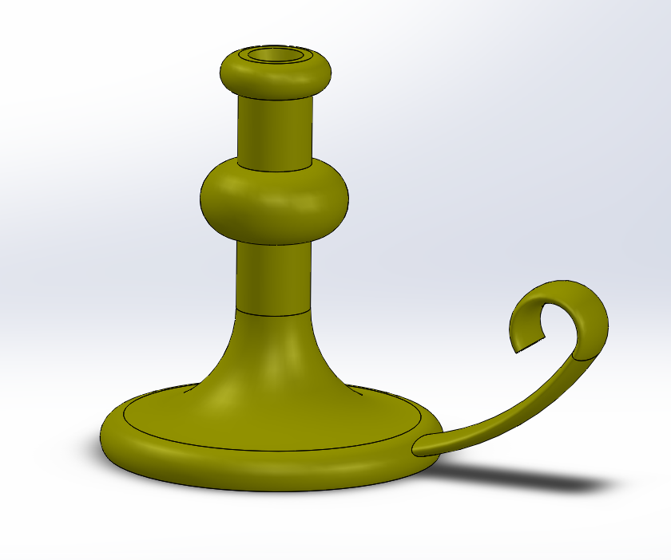

# Cad_Images

# Introduction

### Description

The introduction assignment is an assignment to refresh your SolidWorks knowledge

### What I learned
* I learned that SolidWorks has helpful tutorials about various projects
* I bettered my knowledge of a linear pattern
* I also learned more about mating two parts

### Images

Assembly:

Introduction:

# Sweeps and Lofts

### Description

Sweeps and lofts is an assignment that helps you understand more complex SolidWorks skills.

### What I learned
* I learned how to make multiple planes
* I learned how to use the "flex" tool
* I learned how to use curves to benefit our final product

### Images

Sweeps:

Loft:

